# 🛡️ Project: Windows AD Lab with Security Hardening & GPO Enforcement

## 🎯 Why I Built This Project : 

This lab project simulates a small enterprise IT environment by setting up a Windows Server Active Directory (AD) Domain Controller and a domain-joined Windows 10 client inside a VirtualBox network. The project was designed to practice and demonstrate core concepts in:

| Area                   | Impact                                                                 |
|------------------------|------------------------------------------------------------------------|
| System Administration  | Centralized management of users, computers, and security policies      |
| Help Desk              | Learned how to apply and troubleshoot policies that affect end users   |
| Defensive Security     | Implemented endpoint hardening to reduce common attack vectors         |


## 🛠️ Environment Setup (Windows Server + Windows 10 in VirtualBox)
This section documents how I set up the lab environment using VirtualBox, configured a Windows Server 2019(Evaluation ISO) as a Domain Controller, and joined a Windows 10 machine to the domain.

### 📥 1. Downloading ISOs

| Operating System             | Download Link                                                                 |
|-----------------------------|-------------------------------------------------------------------------------|
| Windows Server 2019 Eval    | [Download](https://www.microsoft.com/en-us/evalcenter/evaluate-windows-server-2019) |
| Windows 10 ISO              | [Download](https://www.microsoft.com/en-us/software-download/windows10)       |

---

### 🖥️ 2. Create VMs in VirtualBox

You'll create two virtual machines:

| VM Name       | OS Version             | RAM     | Disk Size | Network        |
|---------------|------------------------|---------|-----------|----------------|
| Win_server    | Windows Server 2019    | 4–8 GB  | 40 GB     | (To be configured) |
| Win10-Client  | Windows 10             | 2–4 GB  | 40 GB     | (To be configured) |

---

### 🌐 3. Create NAT Network (VirtualBox)

This allows both VMs to communicate internally and access the internet.

### 🛠️ Steps to Create NAT Network:

1. Open **VirtualBox** → Go to **File > Tools > Network Manager**  
   *(or Preferences > Network on some systems)*

2. Click **Add (+)** to create a new NAT Network.

3. Enable the following options:
   - ✔️ **Enable Network**
   - ✔️ **Supports DHCP**

4. Name it something like `LabNAT`.


#### 🔧 Configure Each VM:

For **each VM**, go to:

- **Settings > Network > Adapter 1**
  - **Attached to**: `NAT Network`
  - **Name**: `LabNAT`

---

### 🧱 4. Install Windows Server 2019 (Domain Controller)

1. Start the **Win_server VM**.
2. Boot from the ISO and follow the standard installation process.
3. Choose:
   - `Windows Server 2019 Standard (with Desktop Experience)`
4. Set an administrator password and wait for installation to complete.

---

### ⚙️ 5. Promote Server to Domain Controller

After Windows Server is installed:

#### 🔹 Step 1: Rename the Computer

- Go to: **System > Rename this PC**
- Rename to: `DC01`
- Restart the server

#### 🔹 Step 2: Install AD DS Role

1. Open **Server Manager**
2. Click **Manage > Add Roles and Features**
3. Choose:
   - **Role-based or feature-based installation**
   - Add: **Active Directory Domain Services**
4. Follow prompts and install

#### 🔹 Step 3: Promote to Domain Controller

1. After installation, click:  
   **"Promote this server to a domain controller"**
2. Choose:
   - **Add a new forest**
   - Root domain name: `LAB.learn` *(or any name you prefer)*
3. Set the **DSRM password**
4. Finish the wizard and restart the server

---

### 🪪 6. Create a Domain User

1. Go to:  
   **Server Manager > Tools > Active Directory Users and Computers**
2. In the left panel, expand the domain
3. Right-click **Users** → **New** → **User**
4. Fill in the user details:

   - **Username**: `lablearn1`  
   - **Password**: set accordingly

---

## 🖥️ 7. Install & Configure Windows 10 Client

1. Boot the **Win10-Client VM** from the Windows 10 ISO.
2. Proceed with the normal installation process.
3. Create a **local user** account during setup.

---

## 🔗 8. Join Windows 10 to Domain

#### 🔹 Step 1: Configure Network

Ensure the Windows 10 client can reach the domain controller.

Open Command Prompt and run:

```cmd
ping DC01
ping [Server_IP]
```
If there's no response, make sure both VMs are attached to the same NAT Network or Internal Network in VirtualBox.

#### 🔹 Step 2: Set DNS to Domain Controller IP
Go to:

Control Panel > Network & Sharing Center > Change adapter settings
Right-click the active adapter → Properties

Select Internet Protocol Version 4 (TCP/IPv4) → Properties

Set the Preferred DNS Server to the IP of DC01 (e.g., 10.0.2.1)

#### 🔹 Step 3: Join the Domain
Open:

Settings > System > About > Rename this PC (Advanced) > Change
Choose:

Member of domain → LAB.learn

When prompted, enter domain credentials
(e.g., Administrator or lablearn1)

Restart the computer

✅ Now your Windows 10 client is successfully joined to the domain and can be managed using Group Policy!

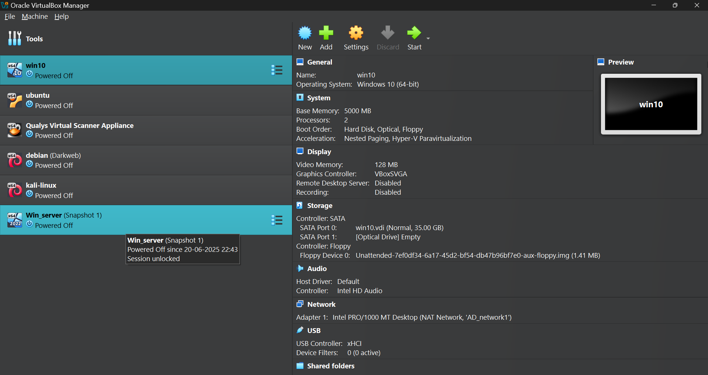
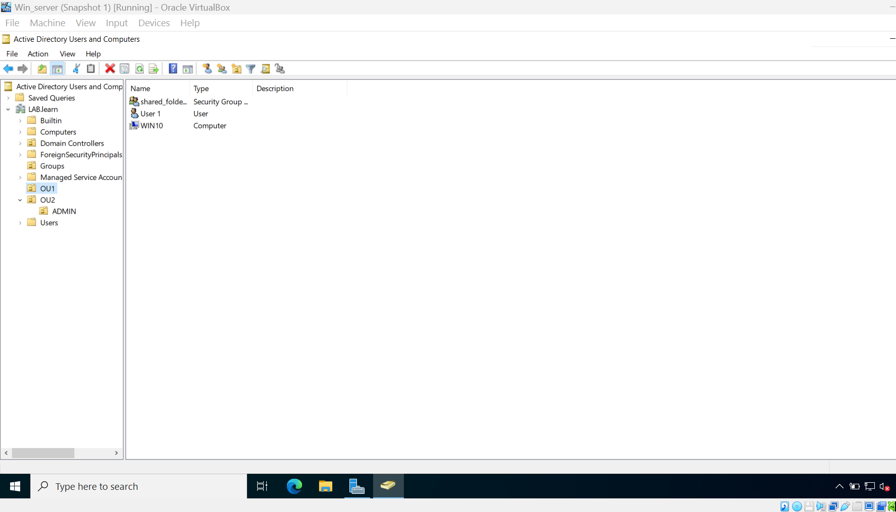


## 🛡️ Group Policy Implementation & Security Hardening

These policies were applied using Group Policy Management Console (GPMC) on the Domain Controller to harden the Windows environment and reduce the attack surface on domain-joined clients.

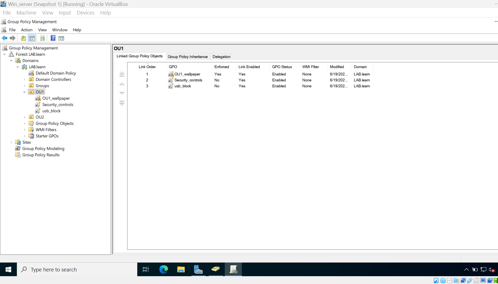

---

### 1. 🔐 Enforce Password Complexity & Policy

**Where to configure:**

GPMC > Default Domain Policy
→ Computer Configuration → Policies → Windows Settings → Security Settings → Account Policies → Password Policy


**What to change:**

- Enforce password complexity → Enabled  
- Minimum password length → 8  
- Minimum password age → 1 day  
- Maximum password age → 30 days  

**Impact:**

- Prevents weak passwords  
- Forces regular password changes  
- Helps mitigate brute-force and credential stuffing attacks

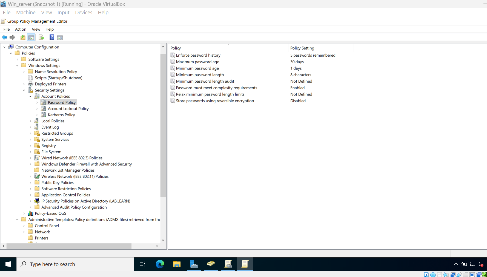

### 2. 🔒 Account Lockout Policy

**Where to configure:**

GPMC > Default Domain Policy
→ Computer Configuration → Policies → Windows Settings → Security Settings → Account Policies → Account Lockout Policy


**What to change:**

- Account lockout threshold → 3 attempts  
- Lockout duration → 0 minutes (Admin can only unlock the account)  
- Reset lockout counter after → 2 minutes


**Impact:**

- Blocks repeated failed login attempts  
- Protects against password-guessing and brute-force login attacks

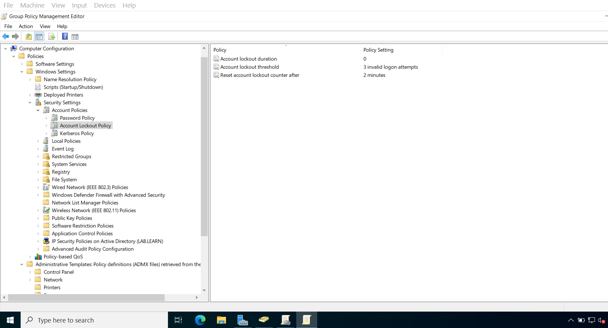

### 3. 🚫 Block USB Storage Devices

**Where to configure:**

New GPO (e.g., Block USB)
→ Computer Configuration → Policies → Administrative Templates → System → Removable Storage Access


**What to change:**

- All Removable Storage classes: Deny all access → **Enabled**

**Impact:**

- Prevents use of USB drives (data theft, malware delivery)  
- Enforces data loss prevention (DLP) policies

<p align="center">
  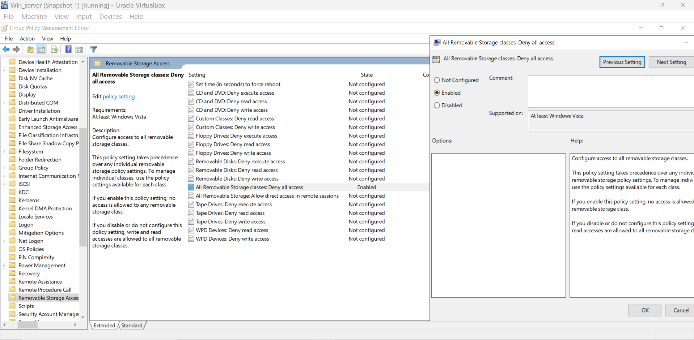
  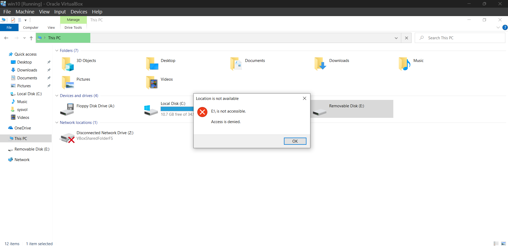
</p>

### 4. 💻 Disable Command Prompt

**Where to configure:**

User Configuration → Administrative Templates → System

**What to change:**

- Prevent access to command prompt → **Enabled**  
- Disable script processing → **Yes**

**Impact:**

- Prevents command-line misuse  
- Reduces risk of internal privilege escalation or running malicious scripts

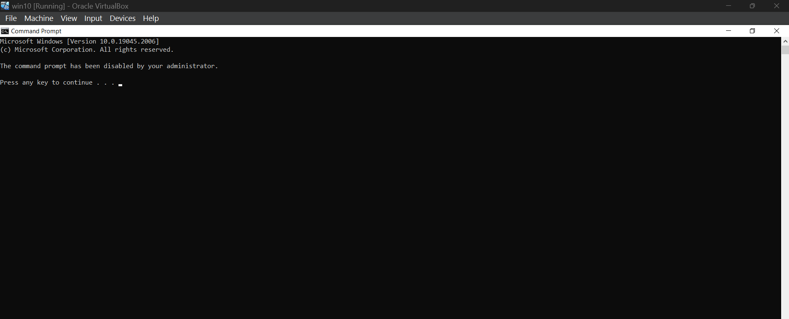

### 5. 🧪 Disable PowerShell

**Where to configure:**

User Configuration → Administrative Templates → System
→ Don't run specified Windows applications


**What to change:**

1. Enable the setting  
2. Click **Show...** and add:

%SystemRoot%\Windows\System32\WindowsPowerShell\v1.0\powershell.exe


**Impact:**

- Prevents use of PowerShell by standard users  
- Blocks one of the most powerful tools attackers and malware often use

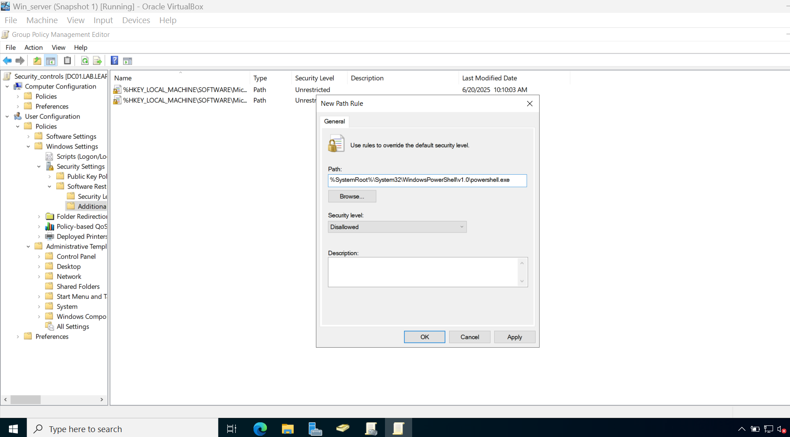

### 6. 🔧 Disable Task Manager

**Where to configure:**

User Configuration → Administrative Templates → System → Ctrl+Alt+Del Options


**What to change:**

- Remove Task Manager → **Enabled**

**Impact:**

- Prevents users from ending important background services or security tools  
- Enhances control over the user environment in lab or restricted settings

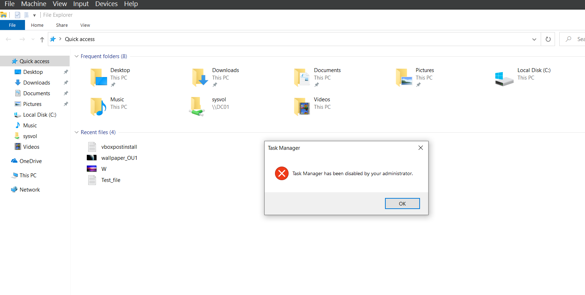

### 8. 🛡️ Enable Real-Time Protection (Windows Defender)

**Where to configure:**

Computer Configuration → Administrative Templates → Windows Components → Microsoft Defender Antivirus → Real-time Protection

**What to change:**

- Turn on real-time protection → **Enabled**

**Impact:**

- Ensures real-time malware protection is active  
- Detects and blocks threats as they occur

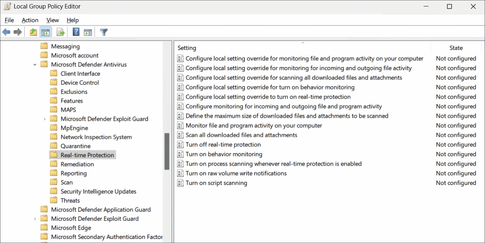

---

## ✅ Summary

This lab walkthrough demonstrated how to configure core **Group Policy Objects (GPOs)** to secure a Windows Active Directory environment. By applying these policies :

- Reduced the attack surface on domain-joined machines  
- Enforced secure user behavior through restrictions and password policies  
- Blocked common tools used in attacks (PowerShell, USBs, Task Manager, etc.)  
- Strengthened endpoint protection with Windows Defender

These configurations are essential for any blue team, SOC analyst, or IT administrator setting up a secure AD lab or enterprise environment.

---

## Final Notes

- This lab is ideal for SOC and Blue Team beginners to gain hands-on experience.
- All screenshots and settings are tested on Windows Server 2019 and Windows 10.
- Feel free to fork, clone, or expand this repo for your own blue team toolkit or homelab!

---

> 🛡️ *Security is not a one-time setup — it's continuous defense. Keep monitoring, patching, and hardening.*

